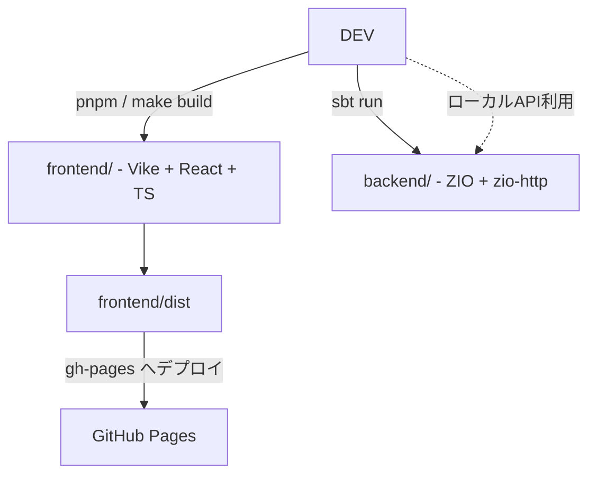
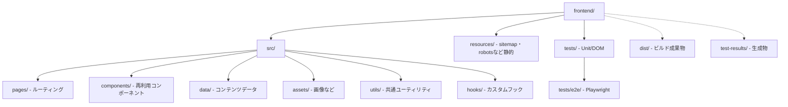

ara-ta3の物置
---

https://ara-ta3.github.io/

## ディレクトリ構成

フロントエンドのコードは `frontend/` ディレクトリ以下に配置されています。pnpm のワークスペース機能を利用して管理しています。

バックエンドのコードは `backend/` ディレクトリ以下に Scala で構成されています。

## 技術構成図

## フロントエンド構成図

