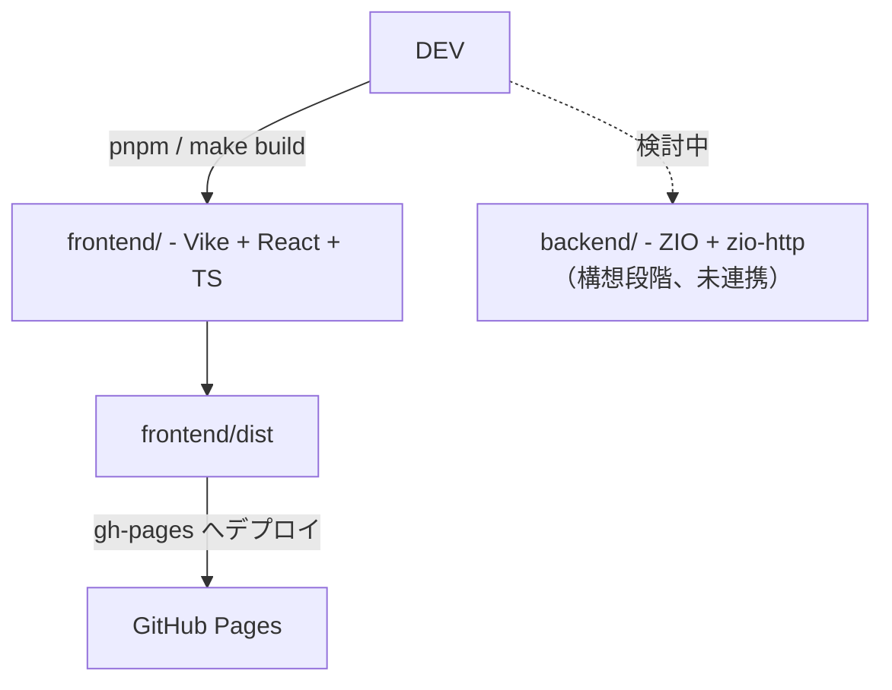

ara-ta3の物置
---

https://ara-ta3.github.io/

## ディレクトリ構成

フロントエンドのコードは `frontend/` ディレクトリ以下に配置されています。pnpm のワークスペース機能を利用して管理しています。

バックエンドは `backend/` に Scala で置く構想がありますが、今のところやりたいことが不明確で未実装です。  

## 技術構成図



## フロントエンド構成図

```
frontend/
├─ package.json
├─ vite.config.ts
├─ resources/ (sitemap・robots・cat assets)
├─ src/
│  ├─ pages/ (Vike ルーティング)
│  │  ├─ +Layout.tsx
│  │  ├─ +Head.tsx
│  │  ├─ +config.ts
│  │  ├─ index/
│  │  ├─ articles/
│  │  ├─ projects/
│  │  │  ├─ +Page.tsx
│  │  │  └─ @id/ (+Page.tsx, +onBeforePrerenderStart.ts など)
│  │  ├─ schedules/
│  │  └─ electricity/
│  ├─ components/ (project/headertags/articles など UI)
│  ├─ data/
│  ├─ assets/
│  ├─ domains/
│  ├─ hooks/
│  ├─ utils/
│  └─ types/
└─ tests/ (Vitest/Playwright)
   └─ e2e/
```
