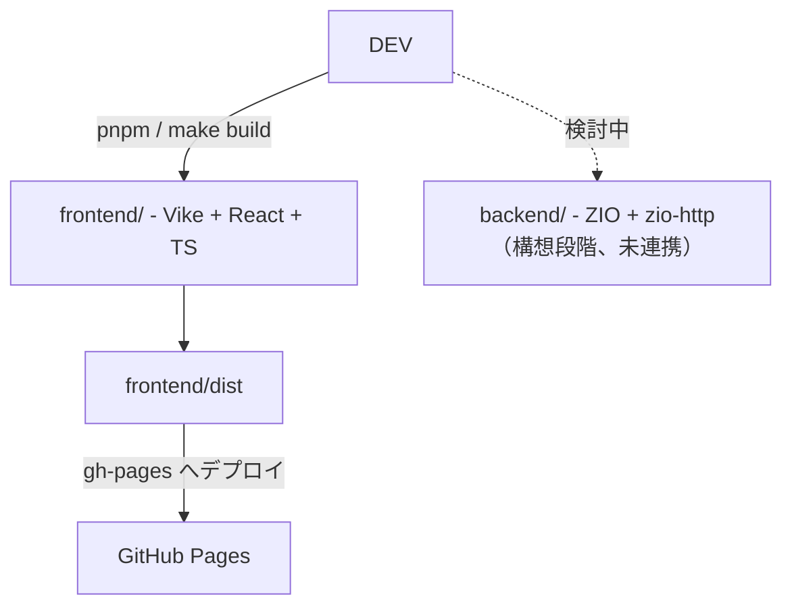

ara-ta3の物置
---

https://ara-ta3.github.io/

## ディレクトリ構成

フロントエンドのコードは `frontend/` ディレクトリ以下に配置されています。pnpm のワークスペース機能を利用して管理しています。

バックエンドは `backend/` に Scala で置く構想がありますが、今のところやりたいことが不明確で未実装です。  

## 技術構成図


```mermaid
graph TD
  Dev[DEV] -->|pnpm / make build| FE[frontend/ - Vike + React + TS]
  FE --> Dist[frontend/dist]
  Dist -->|gh-pages へデプロイ| Pages[GitHub Pages]
  Dev -.->|検討中| BE[backend/ - ZIO + zio-http（構想段階、未連携）]
```

## フロントエンド構成図

```
frontend/
├─ package.json
├─ vite.config.ts
├─ resources/ (sitemap・robots・cat assets)
├─ src/
│  ├─ pages/ (Vike ルーティング)
│  │  ├─ +Layout.tsx
│  │  ├─ +Head.tsx
│  │  ├─ +config.ts
│  │  ├─ index/
│  │  ├─ articles/
│  │  ├─ projects/
│  │  │  ├─ +Page.tsx
│  │  │  └─ @id/ (+Page.tsx, +onBeforePrerenderStart.ts など)
│  │  ├─ schedules/
│  │  └─ electricity/
│  ├─ components/ (project/headertags/articles など UI)
│  ├─ data/
│  ├─ assets/
│  ├─ domains/
│  ├─ hooks/
│  ├─ utils/
│  └─ types/
└─ tests/ (Vitest/Playwright)
   └─ e2e/
```

## スライドテーマのビジュアル回帰テスト

`slides/themes/ara-ta3.css` の変更を検知するため、`slides/ara-ta3-theme-showcase.md` を見本スライドとして Playwright の `toHaveScreenshot` で比較している。

### 実行

```bash
make test/e2e            # 比較実行 (Playwright 全体)
make test/e2e/update     # 意図した変更に合わせて baseline を更新 (ローカル OS の PNG が出力される)
```

### baseline 更新 (CI と同じ Linux 環境で再生成する)

baseline スナップショットは `*-chromium-linux.png` のみを commit している (CI が `ubuntu-latest` で動くため)。macOS などでローカルに `make test/e2e/update` を走らせると、その OS 用の PNG (`*-chromium-darwin.png` など) が生成されるが、それらは `frontend/tests/e2e/slides-visual.spec.ts-snapshots/.gitignore` によって commit 対象から除外されている。

CI が通る baseline を生成するには `frontend/tests/Dockerfile` をビルドして `make test/e2e/update` を走らせる:

```bash
make test/e2e/update/docker
```

`frontend/tests/Dockerfile` は Playwright 公式 image (`mcr.microsoft.com/playwright:v1.58.2-jammy`) に `make` / `fonts-noto-cjk` / Google Chrome (marp/image 用) を足しただけの薄いラッパ。要 Docker Desktop (または OrbStack 等)。

### 注意点

- アンチエイリアスの微差は `playwright.config.ts` の `toHaveScreenshot.maxDiffPixelRatio` で許容している。
- CI が失敗した場合は GitHub Actions の `playwright-report` artifact に diff 画像と HTML レポートが含まれているのでそこで差分を確認する。
